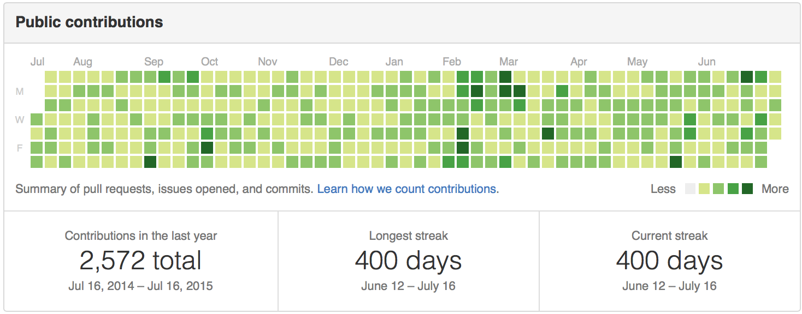
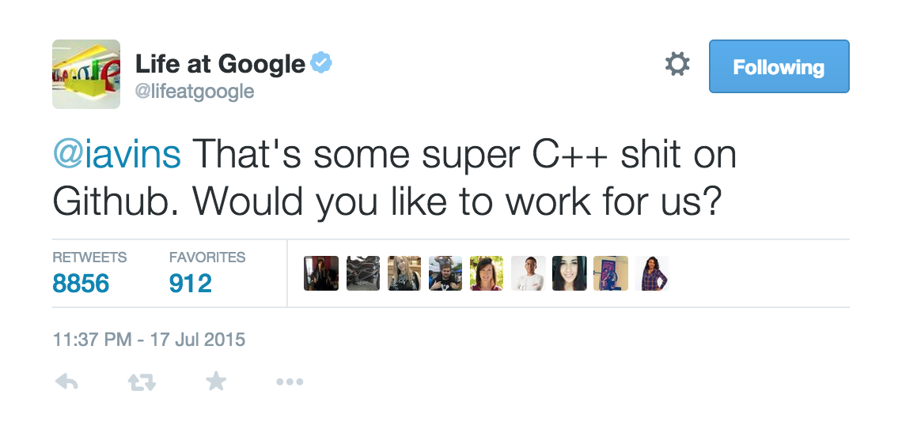
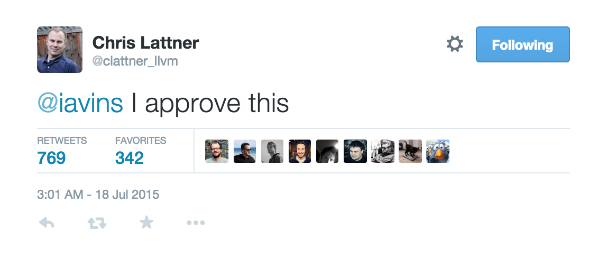

#Rockstar

Rockstar is one amazing library, which will make you a Rockstar Programmer in just 2 minutes. In last decade, people learned [C++ in 21 days](http://www.amazon.com/dp/B0028CK0GW). But these days, it has come down to just [10 minutes](http://www.amazon.com/dp/0672324253). But, I wanted to do better.

This repo will not only teach you Complete C++ in just 2 minutes, but also makes Open Source Contributions. You see, Open Source contributions are very important these days, especially if you can get those boxes filled with green on your Github profile. As an efficient programmer, I believe in killing two birds in just one shot.

Run `Rockstar`, be a Rockstar, show off your Github profile to everyone and bag those $200K programmer jobs. Once you become a Rockstar, every recruiter will want to hire you and there is no turning back.

# Installation

`Rockstar` is Python 3 only library. Rockstar programmers don't code in Python 2.

    pip install rockstar

# Usage

Time is very important. Do not waste time reading large manuals or [listen to people who tell you how to learn C++](http://norvig.com/21-days.html), run these couple of lines instead:

    from rockstar import RockStar

    rock_it_bro = RockStar(days=300)
    rock_it_bro.make_me_a_rockstar()

Above script will create a git repository in the current directory. After that, create a repo on Github and push the local repo. That's all!

`days` specify number of boxes you want to fill with green. Default value is 400. Remember, more commits, more green, more Rockstar you are!

#### Become a Rockstar Swift Programmer with 5 years of experience:

    from rockstar import RockStar

    swift_code = "println('Hello world')"
    rock_it_bro = RockStar(days=1900, file_name='hello.swift', code=swift_code)
    rock_it_bro.make_me_a_rockstar()

#### CLI Masterrace

Sometimes when Atom takes too long time to start, you can use the command line version instead:

    rockstar --days=666

# Testimonials

This is how your profile looks:

Such glorious, much wow!

Many people have received jobs from the big 4 after becoming a Rockstar, using `Rockstar`

and also:

Feel free to send a PR and add your name.

# Todo

- Polyglot Rockstar

# License

The mighty MIT license. Please check `LICENSE` for more details.